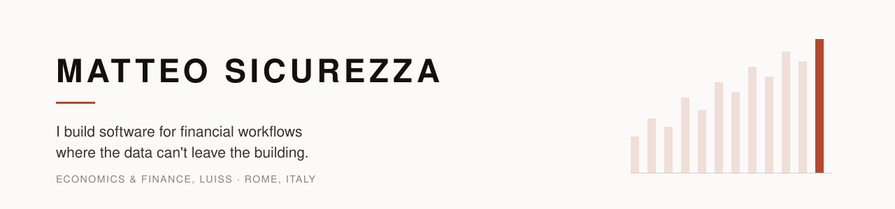

<picture>
  <source media="(prefers-color-scheme: dark)" srcset="assets/banner-dark.svg">
  
</picture>

M.Sc. Administration, Finance & Control @ LUISS Guido Carli · B.Sc. Economics & Management · Rome, Italy

I come from finance, not from CS. That turns out to be the useful half: I can sit with someone doing the work, understand why their process is shaped the way it is, and then go build the thing that replaces it. Everything below started as somebody's bad afternoon with a spreadsheet.

---

## Wealth Advisor Platform · in daily production use

**The problem.** A financial advisor — not named here, for client confidentiality — kept his entire client book in around a hundred separate Excel spreadsheets — a different file per client, per product, per topic, no shared schema, no way to search across them. Answering "what does this family actually hold?" meant opening a dozen files and reconciling them by hand. His firm offers no tool that does this.

**What I built.** One local platform that ingests and normalises those spreadsheets into a single queryable model of clients, products and portfolios, plus the analysis he actually sells: an accumulation / decumulation simulator for funding a child's education, and a succession simulator that models what happens to a client's estate on death.

**Impact.** Replaced a hundred-odd disconnected spreadsheets with one system. Client lookup went from minutes of file archaeology to instant. His daily working tool since June 2026.

**Two decisions worth defending.** It holds real client financial PII under GDPR, held by a regulated professional, so nothing leaves the machine — no cloud database, no third-party service receiving client records. And it has zero dependencies and no build step: one HTML file that opens on a locked-down machine where nothing can be installed. A price bridge on localhost gives it live market data anyway, resolving ISINs to tickers, and falling back to the standard library when `pip install` is blocked.

> Commercial product — source is private. Happy to walk through the code and architecture in a conversation.

[**Read the case study →**](https://github.com/mattsecurity/advisor-platform) · `Vanilla JS · IndexedDB · File System Access API · Python · vector-clock sync`

---

## Advisor Simulators · shipped

The simulators as a standalone app that runs on an iPad, so the advisor runs projections in front of a client without carrying a laptop. Same modelling core, second surface.

[**Repo →**](https://github.com/mattsecurity/app-simulatore) · `JavaScript · offline-first`

---

## Havaly · trip planning, built as a product

A trip planner that composes an itinerary from who you actually are — where you have already been, how far you will walk in a day, who you are travelling with, what you will spend — instead of returning the same top-ten list to everyone.

The LLM call is the easy part. The work is everything around it: an onboarding that calibrates effort and pace instead of guessing taste, cost estimates computed from your actual departure city, and a provider-agnostic model layer so the generator is not married to one vendor. It pulls hotels, activities, places, maps and weather from a stack of third-party APIs, stays usable when a key is absent, and ships to the App Store through Capacitor.

`TypeScript · Vite · Supabase · multi-provider LLM · Capacitor · unit-tested API layer`

---

## Local LLM over the advisor database · next

A natural-language layer on the advisor platform, using a locally-hosted open-weights model: ask a question about the client book in plain Italian, get an answer, with no client data leaving the machine. It is the same problem banks and consultancies are working on right now — useful AI on top of data that regulation will not let you send to an API.

---

## Stack

**Build** `JavaScript` · `TypeScript` · `Python` · `HTML / CSS` · `SQL`
**AI** Multi-provider LLM integration · local open-weights inference · retrieval over private data
**Data** Messy-spreadsheet ingestion · schema normalisation · market data (ISIN → ticker) · offline-first storage · vector-clock sync across devices
**Domain** Wealth management · estate & succession planning · portfolio analysis · financial statement analysis

## How I got here

Self-taught, from an obsession rather than a curriculum. I find people who can build the thing I want, work out how they did it, rebuild it myself, then push it somewhere they did not go. Currently spending that energy on open-weights models, and on what you can do with them when the data is too sensitive to send anywhere.

## Contact

[LinkedIn](https://www.linkedin.com/in/matteo-sicurezza/) · m.sicurezza@studenti.luiss.it
